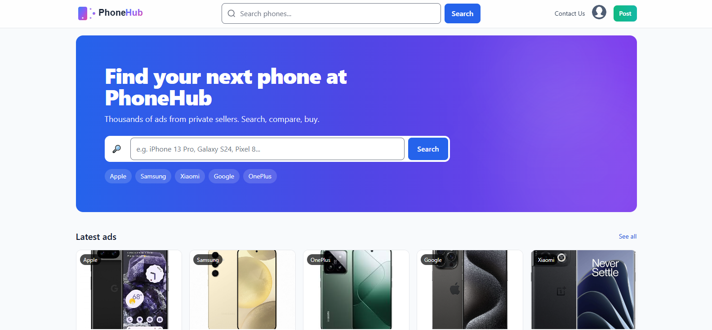
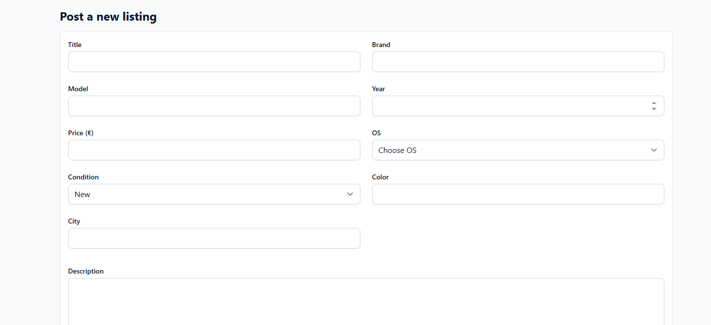
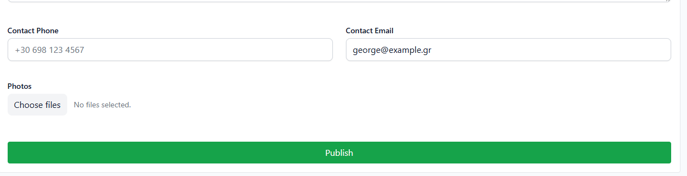
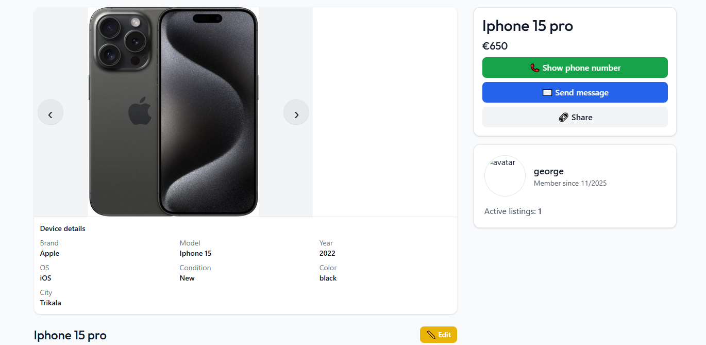
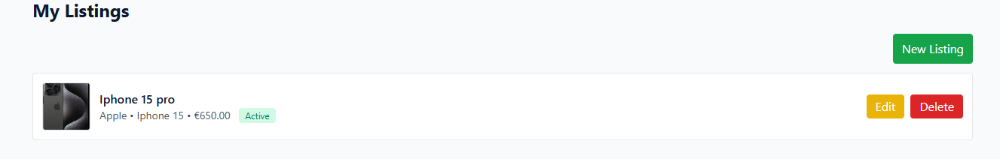

# PhoneHub Website

Welcome to the official repository for **PhoneHub**, an online marketplace dedicated to buying and selling **used mobile phones**.  
Developed with **Laravel**, **MySQL**, and **TailwindCSS**, PhoneHub provides a modern, secure, and user-friendly environment inspired by platforms like *Car.gr* and *Vinted*.

---

## 🚀 Live Demo

🔗 **Coming Soon**

---

## 🧩 Tech Stack

### 🖥️ Backend
- [Laravel 11](https://laravel.com/) – PHP Framework for Web Applications  
- [MySQL](https://www.mysql.com/) – Relational Database Management  
- [Laravel Breeze](https://laravel.com/docs/11.x/starter-kits#laravel-breeze) – Authentication & Starter Kit  

### 🎨 Frontend
- [Blade Templates](https://laravel.com/docs/11.x/blade) – Laravel’s Templating Engine  
- [Tailwind CSS](https://tailwindcss.com/) – Utility-First CSS Framework  
- [Alpine.js](https://alpinejs.dev/) – Lightweight JavaScript Framework  

### 🧰 Tools & Environment
- [XAMPP](https://www.apachefriends.org/) – Local Development Environment  
- [Composer](https://getcomposer.org/) – PHP Dependency Manager  
- [NPM](https://www.npmjs.com/) – Frontend Build Tool  

---


## 🧱 Project Structure
```
PhoneHub/
├── app/                # Application core files
│ ├── Http/
│ │ ├── Controllers/    # Handles requests and responses
│ │ ├── Requests/       # Custom form validation classes
│ ├── Models/           # Eloquent models
├── database/
│ ├── migrations/       # Database schema definitions
│ ├── seeders/          # Test and demo data
├── public/             # Publicly accessible files
│ ├── uploads/          # Uploaded phone images
│ ├── css/              # Compiled stylesheets
│ ├── js/               # Compiled JavaScript
├── resources/
│ ├── views/            # Blade templates (frontend pages)
│ ├── components/       # Reusable Blade components
├── routes/
│ └── web.php           # Web routes definition
```

## Screenshots

### 💻 Desktop View
| Page | Preview |
|------|----------|
| 🏠 **Homepage** |  |
| 📱 **Listings Page** |  |
| 📄 **Listing Page** |  |
| 🧾 **Listing View** |  |
| 📋 **User Dashboard** |  |

## License

This project is licensed under the [MIT license](https://opensource.org/licenses/MIT).
